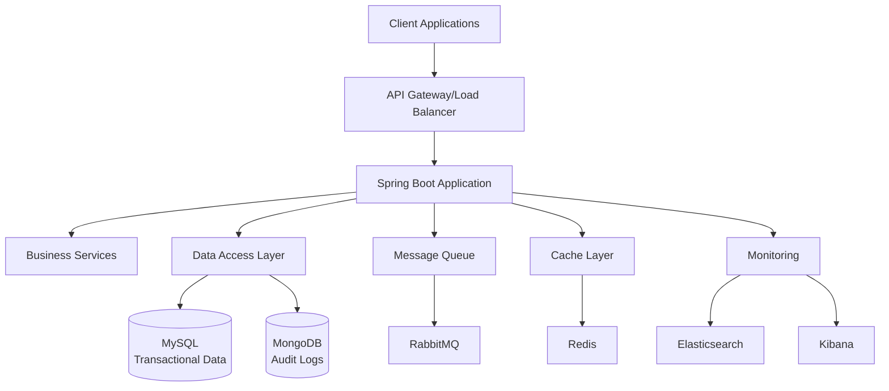

# 🏦 XunimPay Payment System

[](https://openjdk.org/projects/jdk/17/)
[](https://spring.io/projects/spring-boot)
[](https://www.mysql.com/)
[](https://www.docker.com/)
[](https://opensource.org/licenses/MIT)

Sistema completo de gestão de pagamentos desenvolvido como projeto de portfólio, demonstrando competências técnicas alinhadas com as demandas do mercado fintech brasileiro, especialmente para posições de **Desenvolvedor Java Júnior**.

## 📋 Índice

- [Sobre o Projeto](#-sobre-o-projeto)
- [Funcionalidades](#-funcionalidades)
- [Stack Tecnológica](#️-stack-tecnológica)
- [Arquitetura](#️-arquitetura)
- [Pré-requisitos](#-pré-requisitos)
- [Instalação e Execução](#-instalação-e-execução)
- [Uso da API](#-uso-da-api)
- [Testes](#-testes)
- [Monitoramento](#-monitoramento)
- [Estrutura do Projeto](#-estrutura-do-projeto)
- [Contribuição](#-contribuição)
- [Roadmap](#-roadmap)
- [Licença](#-licença)
- [Contato](#-contato)

## 🎯 Sobre o Projeto

O **XunimPay Payment System** é uma aplicação Java completa que simula um sistema real de pagamentos digitais, incorporando as principais funcionalidades de uma fintech moderna:

### **Objetivos do Projeto:**
- Demonstrar domínio técnico em **Java/Spring Boot** e ecossistema relacionado
- Implementar arquitetura escalável com **microserviços** preparados para crescimento
- Aplicar **boas práticas** de desenvolvimento: testes, documentação, observabilidade
- Simular ambiente **produtivo** com Docker, bancos de dados e monitoramento

### **Por que XunimPay?**
Este projeto foi desenvolvido para demonstrar competências em desenvolvimento de sistemas financeiros modernos, incorporando:
- ✅ **Gestão de contas digitais** para usuários
- ✅ **Sistema de pagamentos** (PIX, transferências)
- ✅ **Split de pagamentos** para marketplace
- ✅ **Auditoria completa** de todas as operações
- ✅ **APIs REST** maduras e documentadas

## 🚀 Funcionalidades

### **Core Features**
- 👥 **Gestão de Usuários**
    - Cadastro com validação de CPF/CNPJ
    - Autenticação e autorização
    - Perfis de usuário (individual/empresarial)

- 💳 **Contas Digitais**
    - Criação automática de contas
    - Controle de saldo em tempo real
    - Histórico de transações
    - Bloqueio/desbloqueio de contas

- 💸 **Sistema de Pagamentos**
    - Transferências entre contas
    - Processamento PIX (simulado)
    - Pagamentos com cartão
    - Split de pagamentos para marketplace
    - Controle de limites e validações

- 📊 **Gestão de Recebíveis**
    - Agenda de recebimentos
    - Antecipação de recebíveis
    - Relatórios financeiros
    - Dashboard de métricas

### **Features Técnicas**
- 🔍 **Sistema de Auditoria**
    - Log completo de operações (MongoDB)
    - Rastreamento de transações
    - Histórico de alterações

- 📈 **Monitoramento**
    - Métricas de performance (Micrometer)
    - Logs estruturados (ELK Stack)
    - Health checks automatizados

- 🔒 **Segurança**
    - Validação de entrada
    - Tratamento de exceções
    - Controle de acesso

## 🛠️ Stack Tecnológica

### **Backend Core**
| Tecnologia | Versão | Propósito |
|------------|--------|-----------|
| **Java** | 17 | Linguagem principal |
| **Spring Boot** | 3.2.0 | Framework web |
| **Spring Data JPA** | 3.2.0 | Persistência com Hibernate |
| **Maven** | 3.8+ | Gerenciamento de dependências |
| **MySQL** | 8.0 | Banco relacional (transações) |
| **MongoDB** | 7.0 | Banco NoSQL (auditoria) |

### **Infraestrutura & DevOps**
| Tecnologia | Versão | Propósito |
|------------|--------|-----------|
| **Docker** | Latest | Containerização |
| **Docker Compose** | Latest | Orquestração de containers |
| **Redis** | 7.0 | Cache distribuído |
| **RabbitMQ** | 3.12 | Mensageria assíncrona |

### **Monitoramento & Observabilidade**
| Tecnologia | Versão | Propósito |
|------------|--------|-----------|
| **Elasticsearch** | 8.11 | Motor de busca e logs |
| **Kibana** | 8.11 | Visualização de dados |
| **Micrometer** | Latest | Métricas de aplicação |
| **Actuator** | 3.2.0 | Health checks |

### **Testes & Qualidade**
| Tecnologia | Versão | Propósito |
|------------|--------|-----------|
| **JUnit 5** | Latest | Testes unitários |
| **Mockito** | Latest | Mocking framework |
| **TestContainers** | 1.19.3 | Testes de integração |
| **AssertJ** | Latest | Assertions fluentes |

### **Documentação**
| Tecnologia | Versão | Propósito |
|------------|--------|-----------|
| **OpenAPI 3** | Latest | Especificação da API |
| **Swagger UI** | Latest | Interface de documentação |
| **Lombok** | Latest | Redução de boilerplate |

## 🏗️ Arquitetura

### **Visão Geral**


### **Camadas da Aplicação**
```
┌─────────────────┐
│   Controllers   │ ← API REST Endpoints
├─────────────────┤
│    Services     │ ← Lógica de Negócio
├─────────────────┤
│  Repositories   │ ← Acesso a Dados
├─────────────────┤
│   Entities      │ ← Modelos de Domínio
└─────────────────┘
```

### **Principais Padrões Implementados**
- **Repository Pattern** - Abstração do acesso a dados
- **Service Layer** - Separação da lógica de negócio
- **DTO Pattern** - Transferência de dados entre camadas
- **Builder Pattern** - Construção de objetos complexos
- **Strategy Pattern** - Diferentes tipos de pagamento

## 📋 Pré-requisitos

### **Desenvolvimento**
- **Java 17** ou superior
- **Maven 3.8+** para gerenciamento de dependências
- **Docker Desktop** para containerização
- **Git** para controle de versão

### **IDE Recomendada**
- **IntelliJ IDEA Ultimate** (com suporte completo a Spring Boot)
- Ou **VS Code** com Extension Pack for Java

### **Verificação dos Pré-requisitos**
```bash
# Verificar Java
java -version

# Verificar Maven
mvn -version

# Verificar Docker
docker --version
docker compose version

# Verificar Git
git --version
```

## 🚀 Instalação e Execução

### **Método 1: Execução Completa com Docker (Recomendado)**

```bash
# 1. Clone o repositório
git clone https://github.com/seu-usuario/xunimpay-payment-system.git
cd xunimpay-payment-system

# 2. Execute o ambiente completo
docker compose up -d

# 3. Aguarde todos os serviços iniciarem (2-3 minutos)
docker compose ps

# 4. Verifique se a aplicação está saudável
curl http://localhost:8080/api/health
```

### **Método 2: Desenvolvimento Local (IntelliJ)**

```bash
# 1. Clone o repositório
git clone https://github.com/seu-usuario/xunimpay-payment-system.git
cd xunimpay-payment-system

# 2. Suba apenas os bancos de dados
docker compose -f docker-compose.dev.yml up -d

# 3. Compile o projeto
./mvnw clean compile

# 4. Execute no IntelliJ ou via Maven
./mvnw spring-boot:run -Dspring-boot.run.profiles=dev
```

### **Método 3: Teste Rápido com H2**

```bash
# Para teste rápido sem dependências externas
./mvnw spring-boot:run -Dspring-boot.run.profiles=h2

# H2 Console disponível em: http://localhost:8080/h2-console
```

### **Configuração IntelliJ IDEA**

1. **Abrir Projeto:**
    - File → Open → Selecionar pasta do projeto
    - Aguardar indexação automática do Maven

2. **Configurar Run Configuration:**
    - Run → Edit Configurations
    - Add New → Spring Boot
    - Main class: `com.xunim.paymentsystem.PaymentSystemApplication`
    - Program arguments: `--spring.profiles.active=dev`

3. **Habilitar Annotation Processing:**
    - File → Settings → Build → Compiler → Annotation Processors
    - ✅ Enable annotation processing

## 🌐 Uso da API

### **Endpoints Disponíveis**

A aplicação expõe uma API REST completa e documentada. Acesse a **documentação interativa** em:

**📖 Swagger UI:** http://localhost:8080/api/swagger-ui.html

### **Endpoints Principais**

#### **Usuários**
```http
# Criar usuário
POST /api/v1/users
Content-Type: application/json

{
  "email": "usuario@email.com",
  "document": "12345678901",
  "fullName": "Nome Completo",
  "phone": "11999999999"
}

# Buscar usuário
GET /api/v1/users/{id}

# Listar usuários
GET /api/v1/users?page=0&size=10&sort=createdAt,desc
```

#### **Contas**
```http
# Criar conta
POST /api/v1/accounts
{
  "userId": 1
}

# Consultar saldo
GET /api/v1/accounts/{id}/balance

# Histórico de transações
GET /api/v1/accounts/{id}/transactions
```

#### **Pagamentos**
```http
# Processar pagamento
POST /api/v1/payments
{
  "fromAccountId": 1,
  "toAccountId": 2,
  "amount": 100.50,
  "paymentType": "PIX",
  "description": "Pagamento teste"
}

# Consultar status
GET /api/v1/payments/{transactionId}
```

### **Exemplos com cURL**

```bash
# Health Check
curl -X GET "http://localhost:8080/api/health"

# Criar usuário
curl -X POST "http://localhost:8080/api/v1/users" \
  -H "Content-Type: application/json" \
  -d '{
    "email": "teste@email.com",
    "document": "12345678901",
    "fullName": "Usuário Teste",
    "phone": "11999999999"
  }'

# Listar usuários
curl -X GET "http://localhost:8080/api/v1/users"
```

### **Códigos de Status HTTP**

| Código | Descrição | Quando ocorre |
|--------|-----------|---------------|
| `200` | OK | Operação realizada com sucesso |
| `201` | Created | Recurso criado com sucesso |
| `400` | Bad Request | Dados inválidos ou regra de negócio violada |
| `404` | Not Found | Recurso não encontrado |
| `500` | Internal Server Error | Erro interno do servidor |

## 🧪 Testes

O projeto possui cobertura abrangente de testes em múltiplas camadas:

### **Executar Todos os Testes**
```bash
# Testes completos
./mvnw test

# Testes com relatório de cobertura
./mvnw test jacoco:report

# Ver relatório de cobertura
open target/site/jacoco/index.html
```

### **Tipos de Teste**

#### **1. Testes Unitários**
- **Localização:** `src/test/java/**/*Test.java`
- **Framework:** JUnit 5 + Mockito
- **Cobertura:** Services, Utilities, Validators

```bash
# Apenas testes unitários
./mvnw test -Dtest="**/*Test.java"
```

#### **2. Testes de Integração**
- **Localização:** `src/test/java/**/*IntegrationTest.java`
- **Framework:** TestContainers + Spring Boot Test
- **Cobertura:** APIs REST, Repositories, Database

```bash
# Apenas testes de integração
./mvnw test -Dtest="**/*IntegrationTest.java"
```

#### **3. Testes de Performance (Opcional)**
```bash
# Testes de carga com JMeter (se configurado)
./scripts/performance-test.sh
```

### **Cobertura de Testes**

Objetivo: **>80% de cobertura** nas camadas críticas:
- ✅ **Services:** >90%
- ✅ **Controllers:** >85%
- ✅ **Repositories:** >80%
- ✅ **Utilities:** >95%

### **Executar Testes no IntelliJ**

1. **Todos os testes:** Clique direito em `src/test/java` → "Run All Tests"
2. **Classe específica:** Clique direito na classe → "Run 'ClassTest'"
3. **Com cobertura:** Clique direito → "Run 'All Tests' with Coverage"

## 📊 Monitoramento

### **URLs de Monitoramento**

| Serviço | URL | Credenciais |
|---------|-----|-------------|
| **Swagger API** | http://localhost:8080/api/swagger-ui.html | - |
| **Actuator Health** | http://localhost:8080/api/actuator/health | - |
| **Actuator Metrics** | http://localhost:8080/api/actuator/metrics | - |
| **Kibana Dashboard** | http://localhost:5601 | - |
| **RabbitMQ Management** | http://localhost:15672 | admin/admin |
| **H2 Console** (dev) | http://localhost:8080/h2-console | sa/password |

### **Métricas Disponíveis**

#### **Métricas de Aplicação**
```bash
# Métricas gerais
curl http://localhost:8080/api/actuator/metrics

# Métricas específicas
curl http://localhost:8080/api/actuator/metrics/users.created
curl http://localhost:8080/api/actuator/metrics/payments.processed
curl http://localhost:8080/api/actuator/metrics/jvm.memory.used
```

#### **Métricas de Negócio**
- **users.created** - Total de usuários criados
- **payments.processed** - Pagamentos processados
- **accounts.balance.total** - Soma de saldos ativos
- **transactions.per.minute** - TPS de transações

### **Logs Estruturados**

Os logs são enviados para **Elasticsearch** e visualizados no **Kibana**:

```bash
# Ver logs em tempo real
docker compose logs -f app

# Filtrar logs por nível
docker compose logs app | grep ERROR
```

### **Dashboards Kibana**

Acesse http://localhost:5601 e configure:

1. **Index Pattern:** `xunimpay-logs-*`
2. **Dashboards principais:**
    - Visão geral da aplicação
    - Métricas de pagamentos
    - Logs de erro e exceções
    - Performance de APIs

## 📁 Estrutura do Projeto

```
xunimpay-payment-system/
├── 📄 README.md                          # Documentação principal
├── 📄 docker-compose.yml                 # Ambiente completo
├── 📄 docker-compose.dev.yml             # Apenas bancos de dados
├── 📄 pom.xml                            # Dependências Maven
├── 📄 Dockerfile                         # Imagem da aplicação
│
├── 📁 src/main/java/com/xunim/paymentsystem/
│   ├── 📄 PaymentSystemApplication.java  # Classe principal
│   │
│   ├── 📁 config/                        # Configurações
│   │   ├── DatabaseConfig.java
│   │   ├── SecurityConfig.java
│   │   ├── OpenApiConfig.java
│   │   └── MetricsConfig.java
│   │
│   ├── 📁 controller/                    # Controllers REST
│   │   ├── UserController.java
│   │   ├── AccountController.java
│   │   ├── PaymentController.java
│   │   └── HealthController.java
│   │
│   ├── 📁 dto/                           # Data Transfer Objects
│   │   ├── request/
│   │   │   ├── CreateUserRequest.java
│   │   │   ├── CreateAccountRequest.java
│   │   │   └── CreatePaymentRequest.java
│   │   └── response/
│   │       ├── UserResponse.java
│   │       ├── AccountResponse.java
│   │       └── PaymentResponse.java
│   │
│   ├── 📁 entity/                        # Entidades JPA
│   │   ├── User.java
│   │   ├── Account.java
│   │   ├── Payment.java
│   │   └── AuditLog.java
│   │
│   ├── 📁 enums/                         # Enumerações
│   │   ├── PaymentStatus.java
│   │   ├── PaymentType.java
│   │   └── AccountStatus.java
│   │
│   ├── 📁 exception/                     # Tratamento de exceções
│   │   ├── GlobalExceptionHandler.java
│   │   ├── BusinessException.java
│   │   ├── ResourceNotFoundException.java
│   │   └── ErrorResponse.java
│   │
│   ├── 📁 repository/                    # Repositórios de dados
│   │   ├── mysql/
│   │   │   ├── UserRepository.java
│   │   │   ├── AccountRepository.java
│   │   │   └── PaymentRepository.java
│   │   └── mongodb/
│   │       └── AuditLogRepository.java
│   │
│   ├── 📁 service/                       # Lógica de negócio
│   │   ├── UserService.java
│   │   ├── AccountService.java
│   │   ├── PaymentService.java
│   │   ├── AuditService.java
│   │   └── impl/
│   │       ├── UserServiceImpl.java
│   │       ├── AccountServiceImpl.java
│   │       ├── PaymentServiceImpl.java
│   │       └── AuditServiceImpl.java
│   │
│   └── 📁 util/                          # Utilitários
│       ├── AccountNumberGenerator.java
│       ├── DocumentValidator.java
│       └── DateUtils.java
│
├── 📁 src/main/resources/
│   ├── 📄 application.yml                # Configuração principal
│   ├── 📄 application-dev.yml            # Desenvolvimento
│   ├── 📄 application-docker.yml         # Docker
│   ├── 📄 application-test.yml           # Testes
│   ├── 📄 application-h2.yml             # H2 Database
│   ├── 📄 logback-spring.xml             # Configuração de logs
│   └── 📁 db/migration/                  # Scripts Flyway
│       ├── V1__Create_initial_tables.sql
│       └── V2__Insert_sample_data.sql
│
├── 📁 src/test/java/                     # Testes
│   ├── 📁 integration/
│   │   └── UserIntegrationTest.java
│   ├── 📁 service/
│   │   └── UserServiceTest.java
│   └── 📁 controller/
│       └── UserControllerTest.java
│
├── 📁 scripts/                           # Scripts de automação
│   ├── setup.sh
│   ├── deploy.sh
│   └── performance-test.sh
│
├── 📁 docs/                              # Documentação adicional
│   ├── api-documentation.md
│   ├── deployment-guide.md
│   ├── architecture-decisions.md
│   └── troubleshooting.md
│
└── 📁 monitoring/                        # Configurações de monitoramento
    ├── kibana/
    ├── elasticsearch/
    └── grafana/
```

## 🤝 Contribuição

Contribuições são bem-vindas! Este projeto segue as melhores práticas de desenvolvimento colaborativo.

### **Como Contribuir**

1. **Fork o projeto**
   ```bash
   git clone https://github.com/seu-usuario/xunimpay-payment-system.git
   ```

2. **Crie uma branch para sua feature**
   ```bash
   git checkout -b feature/amazing-feature
   ```

3. **Implemente sua feature**
    - Siga os padrões de código existentes
    - Adicione testes para nova funcionalidade
    - Atualize documentação se necessário

4. **Execute os testes**
   ```bash
   ./mvnw test
   ```

5. **Commit suas alterações**
   ```bash
   git commit -m 'feat: add amazing feature'
   ```

6. **Push para sua branch**
   ```bash
   git push origin feature/amazing-feature
   ```

7. **Abra um Pull Request**
    - Descreva claramente as mudanças
    - Inclua screenshots se aplicável
    - Referencie issues relacionadas

### **Padrões de Código**

- **Estilo:** Seguir [Google Java Style Guide](https://google.github.io/styleguide/javaguide.html)
- **Commits:** Usar [Conventional Commits](https://www.conventionalcommits.org/)
- **Testes:** Cobertura mínima de 80%
- **Documentação:** Atualizar README e JavaDoc

### **Reportar Issues**

Use o template de issue para reportar:
- 🐛 **Bugs**
- 💡 **Sugestões de features**
- 📚 **Melhorias na documentação**
- ⚡ **Problemas de performance**

## 🛤️ Roadmap

### **Versão Atual: v1.0.0**
- [x] ✅ Gestão básica de usuários
- [x] ✅ Sistema de contas digitais
- [x] ✅ Pagamentos simples (PIX/Transferência)
- [x] ✅ Sistema de auditoria
- [x] ✅ APIs REST documentadas
- [x] ✅ Testes unitários e integração
- [x] ✅ Containerização com Docker

### **Próximas Versões**

#### **v1.1.0 - Melhorias Core** (Q1 2025)
- [ ] Split de pagamentos avançado
- [ ] Sistema de notificações (Email/SMS)
- [ ] Dashboard web para usuários
- [ ] Relatórios financeiros

#### **v1.2.0 - Integrações** (Q2 2025)
- [ ] Integração com APIs de bancos (Open Banking)
- [ ] Gateway de pagamento com cartões reais
- [ ] Webhook system para merchants
- [ ] API de consulta CPF/CNPJ

#### **v1.3.0 - Escalabilidade** (Q3 2025)
- [ ] Implementação de Circuit Breaker
- [ ] Rate Limiting avançado
- [ ] Cache distribuído com Redis Cluster
- [ ] Message queues com RabbitMQ

#### **v2.0.0 - Microserviços** (Q4 2025)
- [ ] Separação em microserviços
- [ ] API Gateway com Spring Cloud
- [ ] Service Discovery
- [ ] Distributed tracing

### **Funcionalidades Futuras (Backlog)**
- [ ] Sistema de cashback
- [ ] Programa de pontos/recompensas
- [ ] Análise de risco em tempo real
- [ ] Machine Learning para detecção de fraudes
- [ ] App mobile (React Native/Flutter)
- [ ] Blockchain integration
- [ ] Open Banking Phase 3 compliance

## 📄 Licença

Este projeto está licenciado sob a **MIT License** - veja o arquivo [LICENSE](LICENSE) para detalhes.

```
MIT License

Copyright (c) 2024 [Seu Nome]

Permission is hereby granted, free of charge, to any person obtaining a copy
of this software and associated documentation files (the "Software"), to deal
in the Software without restriction, including without limitation the rights
to use, copy, modify, merge, publish, distribute, sublicense, and/or sell
copies of the Software, and to permit persons to whom the Software is
furnished to do so, subject to the following conditions...
```

## 📞 Contato

### **Desenvolvedor**
- **Nome:** [Seu Nome Completo]
- **Email:** [seu-email@email.com]
- **LinkedIn:** [linkedin.com/in/seu-perfil](https://linkedin.com/in/seu-perfil)
- **GitHub:** [github.com/seu-usuario](https://github.com/seu-usuario)
- **Portfolio:** [seu-portfolio.dev](https://seu-portfolio.dev)

### **Sobre o Projeto**
- **Repositório:** [github.com/seu-usuario/xunimpay-payment-system](https://github.com/seu-usuario/xunimpay-payment-system)
- **Demo Online:** [xunimpay-demo.herokuapp.com](https://xunimpay-demo.herokuapp.com)
- **Documentação API:** [api-docs.xunimpay-demo.herokuapp.com](https://api-docs.xunimpay-demo.herokuapp.com)

---

## 🎯 Agradecimentos

Este projeto foi desenvolvido como demonstração de competências técnicas para oportunidades no mercado fintech brasileiro, focando em sistemas de pagamento modernos e escaláveis.

### **Inspirações e Referências**
- [Spring Boot Documentation](https://spring.io/projects/spring-boot)
- [Clean Architecture - Robert Martin](https://blog.cleancoder.com/uncle-bob/2012/08/13/the-clean-architecture.html)
- [Microservices Patterns - Chris Richardson](https://microservices.io/)
- [Building Event-Driven Microservices - Adam Bellemare](https://www.oreilly.com/library/view/building-event-driven-microservices/9781492057888/)

### **Tecnologias e Comunidades**
Agradecimentos especiais às comunidades open-source das tecnologias utilizadas:
- **Spring Framework Team**
- **Docker Community**
- **JUnit Contributors**
- **TestContainers Project**
- **Elastic Community**

---

<div align="center">

**⭐ Se este projeto foi útil, considere dar uma estrela no GitHub! ⭐**

**Made with ❤️ by Edson Júnior**


</div>

---

> 💡 **Dica:** Para uma experiência completa, execute o projeto com Docker Compose e explore a documentação interativa no Swagger UI!